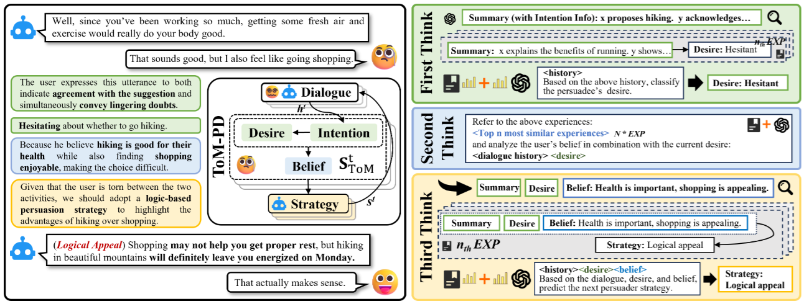

<div align="center">

# 💭 TTBYS: Think Thrice Before You Speak
**Dual Knowledge-Enhanced Theory-of-Mind Reasoning for Persuasive Agents**

[](https://arxiv.org/abs/2605.22602)
[](http://www.apache.org/licenses/LICENSE-2.0)

</div>

Persuasive dialogue requires reasoning about others' latent mental states — a capability known as Theory of Mind (ToM). **TTBYS** introduces the ToM-based Persuasive Dialogue (**ToM-PD**) task, grounded in the Belief-Desire-Intention (BDI) framework, and enhances ToM reasoning with **dual knowledge**: LLM-driven intuition (**AG**) and experience-driven implicit knowledge retrieved from past dialogues (**EX**). Inspired by human deliberative cognition, TTBYS decomposes persuasion into a three-step reasoning chain:

| Step | Module | What It Infers | Dual Knowledge |
|---|---|---|---|
| **First Think** | `first_think.py` | The persuadee's **desire** toward the target action (-1 / 0 / +1) | AG first-token probabilities + EX desire distribution from similar intentions |
| **Second Think** | `second_think.py` | The persuadee's underlying **belief** that causally drives the desire | Retrieved top-K experiences injected as explicit context for LLM belief generation |
| **Third Think** | `third_think.py` | The optimal persuasion **strategy** for the next turn | AG masked-token probabilities over 9 strategies + EX strategy distribution from (intention, belief) retrieval |

<p align="center">
  
</p>

## Quick Start

```bash
# 1. Install dependencies
pip install -r requirements.txt

# 2. Configure
cp .env.example .env
# Edit .env: set EVAL_API_KEY (LLM-judge evaluation) and optionally
# TTBYS_MODEL_DIR (local LLM path; alternatively edit ttbys/config.py)

# 3. Run the three Think modules (first 100 dialogs = eval, rest = experience KB)
cd ttbys
python first_think.py     # -> results/first_think_result.json
python second_think.py    # -> results/second_think_result.json
python third_think.py     # -> results/third_think_result.json

# 4. Evaluate
python first_think_eval.py     # desire accuracy vs fusion α -> results/first_think_acc.png
python second_think_eval.py    # GPT-based belief scoring (uses EVAL_API_KEY from .env)
python third_think_eval.py     # strategy accuracy vs fusion α -> results/third_think_acc.png

# 5. Interactive persuasive agent demo (logs full reasoning chain per turn)
python agent.py
```

---

## Dataset: ToM-PD

The ToM-PD dataset (`data/ToM_BPD.json`, 519 persuasion dialogues) annotates every turn with BDI states:

- **persuadee** turns: `desire` (unwilling / uncertain / willing), `belief` (natural-language reason), `intention`
- **persuader** turns: `strategy` (one of 9 persuasion strategies)

`annotation/` contains the LLM-based dialogue summarization pipeline used during annotation.

> **Note:** the per-turn `intention` field is currently empty in the released dataset; the code falls back to the dialog-level `background` (persuasion-task description) and prints a warning. Fill in per-turn intentions to switch to turn-level experience retrieval.

---

## Repository Structure

```
TTBYS/
├── README.md                       # Project overview and usage
├── LICENSE                         # Apache License 2.0
├── requirements.txt                # Python dependencies
├── .env.example                    # Environment template (safe to share)
├── .env                            # Local config with API keys (gitignored)
├── assets/
│   └── TTBYS.png                   # Framework overview figure
├── ttbys/                          # Core code
│   ├── config.py                   # Centralized paths, model dirs, constants (.env aware)
│   ├── common.py                   # Lazy model loading & shared text/retrieval utilities
│   ├── agent.py                    # Interactive multi-turn persuasive agent
│   ├── first_think.py              # First Think: desire inference (AG + EX)
│   ├── first_think_eval.py         # Fusion-α accuracy evaluation for First Think
│   ├── second_think.py             # Second Think: belief inference
│   ├── second_think_eval.py        # GPT-based belief scoring
│   ├── third_think.py              # Third Think: strategy prediction (AG + EX)
│   └── third_think_eval.py         # Fusion-α accuracy evaluation for Third Think
├── annotation/                     # Dialogue summarization annotation pipeline
├── data/
│   └── ToM_BPD.json                # ToM-PD dataset
├── results/                        # Generated results & figures (gitignored)
└── stats_utterance_length.py       # Utterance-length statistics tool
```

## Evaluation

| Module | Metric | Script |
|---|---|---|
| First Think | Desire accuracy of fused AG+EX distribution, swept over fusion weight α | `first_think_eval.py` |
| Second Think | Belief quality score {0, 0.5, 1} judged by GPT (`EVAL_API_KEY` required) | `second_think_eval.py` |
| Third Think | Strategy top-1 hit rate of fused AG+EX distribution, swept over α | `third_think_eval.py` |

## Citation

If you find TTBYS useful in your research, please cite our paper:

```bibtex
@article{ma2026think,
  title={Think Thrice Before You Speak: Dual knowledge-enhanced Theory-of-Mind Reasoning for Persuasive Agents},
  author={Ma, Minghui and Guo, Bin and Yang, Runze and Chen, Mengqi and Liu, Yan and Liu, Jingqi and Pei, Yahan and Ma, Xuehao and Zhang, Qiuyun and Yu, Zhiwen},
  journal={arXiv preprint arXiv:2605.22602},
  year={2026},
  month={may}
}
```

📄 Paper: [arXiv:2605.22602](https://arxiv.org/abs/2605.22602)
